  

<h3><code>tiago@github ~ $ whoami</code></h3>

<table>
  <tr>
    <td valign="top"></td>
    <td valign="top"></td>
  </tr>
</table>

<h3><code>tiago@github ~ $ ./contributions.sh</code></h3>

  

  Tudo aqui é SVG animado gerado por <a href="./scripts">scripts Python</a> próprios
  e atualizado todo dia por um <a href="./.github/workflows/update-profile-art.yml">GitHub Action</a>.
   Obrigado pela visita! ⭐

